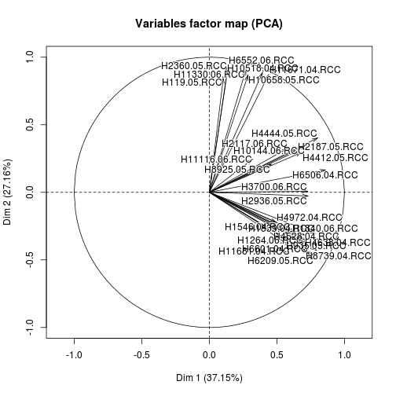
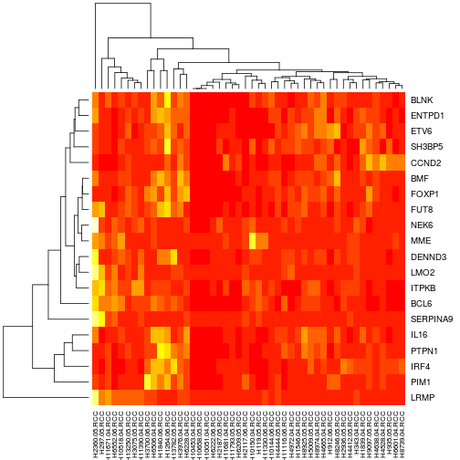
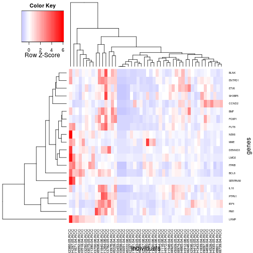

Classification of samples by gene expression data
========================================================

Dr. Susanne Weller
06/05/2014

Import and transform data


```r
genex <- as.data.frame(read.csv("/home/suska/work/Geneex/ClassGeneex/Geneex_full.csv", 
    header = TRUE, quote = "", sep = "\t"))
genex <- subset(genex, genex$Class_Name == "Endogenous")

genex$Class_Name <- NULL


# Transpose table YOU WANT
tgenex <- as.data.frame(t(genex[, 2:ncol(genex)]))

# Set the column headings
colnames(tgenex) <- genex$Gene_Name
tgenex$sample <- row.names(tgenex)
row.names(tgenex) <- NULL
```


Unsupervised classification of patients using gene expression data
------------------------------------------------------------

### Pricipal component analysis


```r
pca.out = prcomp((genex[2:49]), scale = TRUE)
```

```
## Error: cannot rescale a constant/zero column to unit variance
```

```r
pca.out
```

```
## Error: object 'pca.out' not found
```

```r
names(pca.out)
```

```
## Error: object 'pca.out' not found
```

```r
biplot(pca.out, scale = 0.5)
```

```
## Error: object 'pca.out' not found
```

### PCA Using FactoMinR

-This gives a much nicer plot
-dimdesc(pca) tells you the most important variables, which could be used to sort data to create a heat map that shows both clusters nicely.


```r
require(FactoMineR)
```

```
## Loading required package: FactoMineR
```

```r
# PCA with function PCA

pca <- PCA(genex[2:30], scale.unit = TRUE, ncp = 5, graph = T)
```

  

```r
# scale all the features, ncp: number of dimensions kept in the results (by
# default 5)

gene_load <- dimdesc(pca)
gene_load
```

```
## $Dim.1
## $Dim.1$quanti
##               correlation   p.value
## H6506.04.RCC       0.8594 1.207e-06
## H4444.05.RCC       0.8027 2.050e-05
## H935.05.RCC        0.7929 3.055e-05
## H1839.04.RCC       0.7830 4.463e-05
## H6209.05.RCC       0.7730 6.432e-05
## H6601.04.RCC       0.7354 2.204e-04
## H2936.05.RCC       0.7311 2.499e-04
## H3700.06.RCC       0.7286 2.693e-04
## H4528.04.RCC       0.7214 3.304e-04
## H10144.06.RCC      0.7087 4.692e-04
## H8739.04.RCC       0.7066 4.968e-04
## H4638.04.RCC       0.7036 5.377e-04
## H1264.06.RCC       0.7016 5.654e-04
## H4412.05.RCC       0.6830 9.029e-04
## H2187.05.RCC       0.6474 2.030e-03
## H1840.06.RCC       0.6094 4.341e-03
## H1546.04.RCC       0.6069 4.543e-03
## H11681.04.RCC      0.6015 5.019e-03
## H2117.06.RCC       0.5814 7.170e-03
## H4972.04.RCC       0.4956 2.628e-02
## H8925.05.RCC       0.4578 4.236e-02
## 
## 
## $Dim.2
## $Dim.2$quanti
##               correlation   p.value
## H6552.06.RCC       0.9439 4.259e-10
## H11330.06.RCC      0.9073 3.428e-08
## H2360.05.RCC       0.9009 6.056e-08
## H10518.04.RCC      0.8857 2.070e-07
## H11671.04.RCC      0.8701 6.187e-07
## H10658.05.RCC      0.8686 6.836e-07
## H119.05.RCC        0.8505 2.030e-06
## H6601.04.RCC      -0.4537 4.453e-02
## H6209.05.RCC      -0.4670 3.791e-02
## 
## 
## $Dim.3
## $Dim.3$quanti
##               correlation   p.value
## H8925.05.RCC       0.7423 0.0001783
## H11116.06.RCC      0.7349 0.0002235
## H4972.04.RCC       0.7249 0.0002995
## H1546.04.RCC       0.4614 0.0405692
## H1840.06.RCC       0.4545 0.0440756
## H1264.06.RCC       0.4453 0.0491263
```

```r
write.table(gene_load$Dim.1, "Geneload.tsv")
gene_importance <- as.data.frame(gene_load$Dim.1$quanti)
gene_importance$gene <- row.names(gene_importance)
row.names(gene_importance) <- NULL
# This line of code will sort the variables the most linked to each PC. It
# is very useful when you have many variables.
```


### k-means clustering
- this will always give a clustering an should only be used as a control!


```r

km.out = kmeans(tgenex[1:38], 2, nstart = 30)
```

```
## Error: undefined columns selected
```

```r
km.out
```

```
## Error: object 'km.out' not found
```


Heatmap using the "heatmap"" function
-----------------------------------------
- This needs the genes to be the rownames!

```r
heatgenex <- genex
rownames(heatgenex) <- heatgenex$Gene_Name
heatgenex$Gene_Name <- NULL

heatgenex = as.numeric(heatgenex)
```

```
## Error: (list) object cannot be coerced to type 'double'
```

```r
heatmap(as.matrix(heatgenex, rownames.force = TRUE))
```

 

```r

# For the bar on top:
color.map <- function(mol.biol) {
    if (mol.biol == "ALL1/AF4") 
        "#FF0000" else "#0000FF"
}
patientcolors <- unlist(lapply(esetSel$mol.bio, color.map))
```

```
## Error: object 'esetSel' not found
```

```r
heatmap(exprs(esetSel), col = topo.colors(100), ColSideColors = patientcolors)
```

```
## Error: could not find function "exprs"
```


Heatmap using "gplot" package

```r
library("gplots")
```

```
## KernSmooth 2.23 loaded
## Copyright M. P. Wand 1997-2009
## 
## Attaching package: 'gplots'
## 
## The following object is masked from 'package:stats':
## 
##     lowess
```

```r
heatgenex = as.numeric(heatgenex)
```

```
## Error: (list) object cannot be coerced to type 'double'
```

```r
heatmap.2((as.matrix(heatgenex, rownames.force = TRUE)), col = bluered(75), 
    scale = "row", key = TRUE, symkey = FALSE, density.info = "none", trace = "none", 
    cexRow = 0.5, xlab = "individuals", ylab = "genes")
```

 
